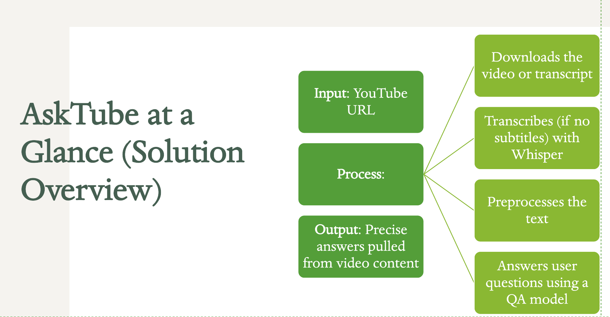

# AskTube: YouTube Video Q&A and Summarization

AskTube is an intelligent tool that allows users to ask questions about YouTube videos and receive context-aware answers. It automatically downloads video audio, transcribes it (using Whisper) or extracts existing subtitles, generates a summary, and utilizes a Retrieval-Augmented Generation (RAG) pipeline to answer user queries based on the video's content.

---

## Table of Contents

*   [Project Overview](#project-overview)
*   [Features](#features)
*   [Technologies Used](#technologies-used)
*   [Folder Structure](#folder-structure)
*   [Setup and Installation](#setup-and-installation)
*   [Running the Application](#running-the-application)
*   [Presentation and Demo](#presentation-and-demo)
*   [Project Report](#project-report)
*   [Team Members](#team-members)

---

## Project Overview

AskTube aims to make video content more accessible and digestible. Users provide a YouTube video URL and can then perform two main actions:



1.  **Process Video:** The application downloads the audio, attempts to fetch existing English subtitles (manual or automatic), or falls back to transcribing the audio using OpenAI's Whisper model. The resulting transcript is preprocessed, and an abstractive summary is generated using Facebook's BART model.
2.  **Ask Question:** Users can ask natural language questions about the video. The system uses a Sentence Transformer model (`all-MiniLM-L6-v2`) to find the most relevant sections of the transcript (Retrieval). These relevant sections are then fed, along with the question, into Google's FLAN-T5 model to generate a grounded answer (Generation).

The entire application is served via a lightweight Flask web server.

---

## Features

*   **YouTube Video Processing:** Accepts YouTube video URLs as input.
*   **Automatic Transcription/Subtitle Extraction:** Uses `yt-dlp` to fetch audio/subtitles and OpenAI's Whisper (`base` model) for accurate speech-to-text when subtitles aren't available.
*   **Text Summarization:** Generates abstractive summaries of video content using `facebook/bart-large-cnn`. Handles long videos via chunking.
*   **Retrieval-Augmented Generation (RAG) for Q&A:**
    *   Uses semantic search (`all-MiniLM-L6-v2`) to find the top 3 relevant text chunks based on the user's query.
    *   Uses a generative model (`google/flan-t5-base`) to synthesize an answer based *only* on the retrieved relevant context.
*   **Web Interface:** Simple Flask-based UI for interacting with the application.

---

## Technologies Used

*   **Backend:** Flask
*   **YouTube Downloader:** `yt-dlp`
*   **Speech-to-Text:** OpenAI `Whisper`
*   **NLP Libraries:**
    *   `transformers` (Hugging Face)
    *   `sentence-transformers`
    *   `torch` (PyTorch)
*   **Core Models:**
    *   Q&A Generation: `google/flan-t5-base`
    *   Summarization: `facebook/bart-large-cnn`
    *   Semantic Search/Retrieval: `all-MiniLM-L6-v2`
*   **Audio Processing Prerequisite:** FFmpeg
*   **Programming Language:** Python 3

---

## Folder Structure

```text
AskTube/
├── downloads/           # Temporary storage for downloaded audio/subtitles
├── preprocessing/       # Stores preprocessed text files
├── summaries/           # Stores generated summary files
├── transcriptions/      # Stores raw transcription/subtitle files
├── templates/
│   ├── base.html        # Base HTML template
│   └── index.html       # Main HTML frontend page
├── static/              # CSS and other static assets
│   └── styles.css
├── app.py               # Main Flask application script
├── config.py            # Configuration settings (optional)
├── requirements.txt     # Python dependencies
└── README.md            # This file
```

---

## Setup and Installation

Follow these steps to set up and run the AskTube project locally.

### 1. Prerequisites

*   **Python:** Ensure Python 3.7+ is installed.
*   **Git:** Required for cloning the repository.
*   **FFmpeg:** Required by `yt-dlp` and `Whisper` for audio processing.

### 2. Install FFmpeg

Follow the instructions below based on your operating system:

*   **Linux (Debian/Ubuntu):**
    ```bash
    sudo apt update && sudo apt install ffmpeg
    ```
*   **macOS (using Homebrew):**
    ```bash
    brew install ffmpeg
    ```
*   **Windows:** Download FFmpeg from the [official website](https://ffmpeg.org/download.html), extract the files, and add the location of the `bin` directory (containing `ffmpeg.exe`) to your system's PATH environment variable.

### 3. Clone the Repository

Clone the AskTube repository to your local machine:

```bash
git clone <your-repository-url> # Replace with your actual repo URL
cd AskTube
```

### 4. Set Up Virtual Environment (Recommended)

It's recommended to use a virtual environment to manage dependencies.

```bash
# Create virtual environment
python -m venv venv

# Activate virtual environment
# On Windows (Git Bash or Command Prompt/PowerShell):
venv\Scripts\activate
# On macOS/Linux:
source venv/bin/activate
```

### 5. Install Dependencies

Install the required Python libraries using pip:

```bash
pip install -r requirements.txt
```
*(Note: This might take some time as it includes large libraries like PyTorch and Transformers.)*

---

## Running the Application

Once the setup is complete, start the Flask application:

```bash
python app.py
```

The application will typically start on `http://127.0.0.1:5000/`. Open this URL in your web browser. You should see the interface where you can input a YouTube URL and ask questions. The terminal running the script will show logs, including model loading, download progress, and processing steps.

---

## Presentation and Demo

You can watch our project presentation and live demo on YouTube:

[https://youtu.be/T0hYptqtG3k]

---

## Project Report

For a detailed overview of the project, including architecture, methodology, contributions, and findings, please refer to our full project report:

[Link to Project Report Here]

---

## Team Members

*   [Luca Donadello](https://github.com/LucaDonadello)
*   [Muralidharan Krishnakumar](https://github.com/MuraliKrishh0811)
*   [Hasan Mohd Hussain](https://github.com/striderzz)